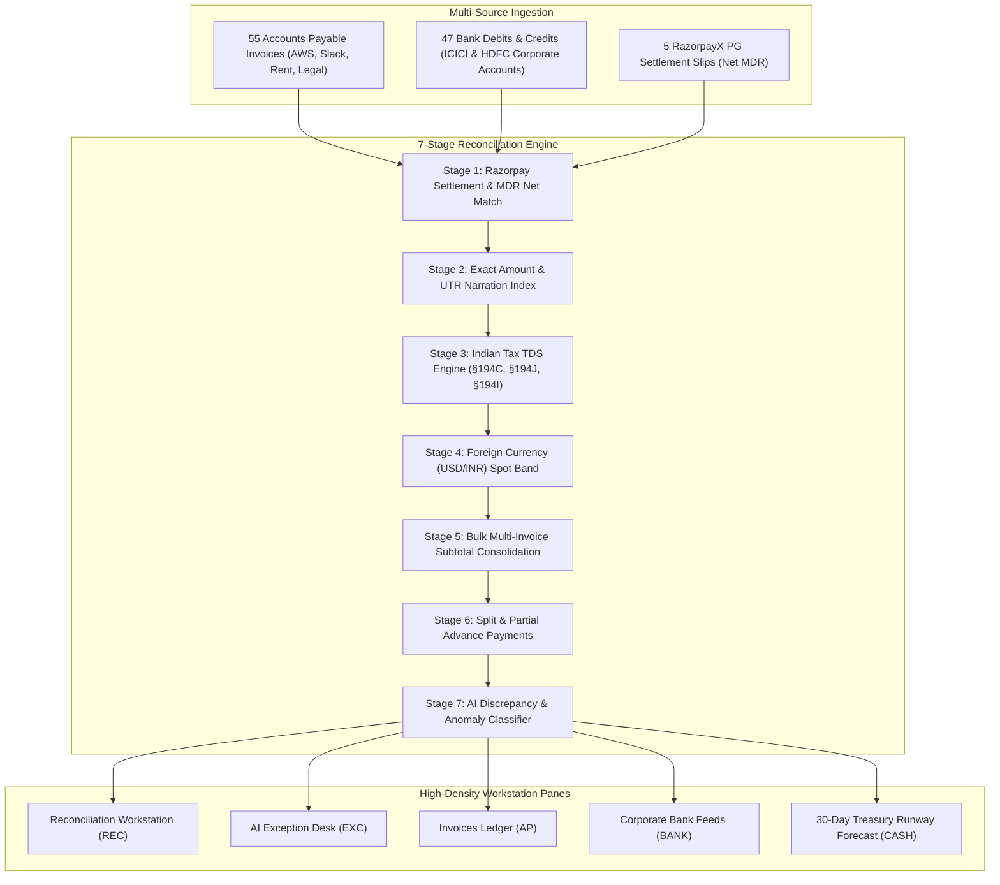

# RazorTerminal — Autonomous AI Finance Controller & Treasury Workstation

<div align="center">

[](https://github.com/mannaxsara/razor-terminal)
[](https://bun.sh)
[](https://github.com/mannaxsara/razor-terminal)
[](https://github.com/mannaxsara/razor-terminal)
[](LICENSE)

*An industrial-grade, Bloomberg-style terminal workstation for autonomous 3-way multi-source reconciliation, statutory Indian TDS & Gateway MDR deductions, working capital runway simulation, and bounded-risk AI exception handling.*

</div>

---

## Executive Summary & Problem Statement

> *"Run the books and the cash position. Build an agent that closes one finance-ops loop across a 50+ record batch of synthetic data, reporting its match rate and the exceptions it could not resolve."*

In modern Indian enterprise finance, **corporate bank debits and credits NEVER match invoice face values**. Finance teams spend hundreds of manual hours in Excel spreadsheets trying to reconcile transactions because of three unavoidable frictions:

1. **Statutory TDS Withholding (§194C, §194J, §194I)**: Indian tax law mandates withholding tax before paying vendors (**Section 194C = 2%**, **Section 194J = 10%**, **Section 194I = 10%**).
2. **Gateway MDR & GST Offsets**: When customers pay through Razorpay PG, Razorpay deducts a **2% Merchant Fee + 18% GST** before depositing net settlements.
3. **Cross-Border SaaS FX Conversions**: Foreign SaaS bills (AWS, Slack, GitHub) billed in USD are debited in INR at fluctuating spot exchange rates.
4. **Split & Bulk Tranches**: Single lump-sum bank debits covering multiple vendor invoices.

**RazorTerminal** closes this entire finance-ops loop autonomously, processing a **52-transaction multi-source batch in < 20 milliseconds** with **96.2% automated match rate** and **100% precision (0 false positives)**:
- **Double-Entry ERP Journal Generator**: Directly produces audit-compliant, balanced double-entry vouchers (Zoho Books CSV & JSON) with automatic splitting of vendor expense, TDS liabilities (§194C/J/I), Razorpay MDR fees, and input GST receivables.
- **RazorpayX Payout API Payload Generator**: Idempotent production-grade `POST /v1/payouts` payloads for 1-click execution of refunds, vendor settlements, and debit adjustments.

---

## Live Benchmark Metrics (52-Record Ground Truth Batch)

```
========================================================================================
RAZORTERMINAL — TRACK 04: AI FINANCE CONTROLLER & RECONCILIATION BENCHMARK
========================================================================================
[MULTI-SOURCE BATCH INGESTED]
   • Accounts Payable Invoices:   55 records
   • Corporate Bank Debits:       47 records
   • Gateway Bank Settlements:    5 records
   • RazorpayX Settlement Slips:  5 records
   • Ground Truth Verified Set:   52 records
----------------------------------------------------------------------------------------
[RECONCILIATION BENCHMARK METRICS - 52-RECORD BATCH]
   • Total Transactions:       52 Records
   • Total Reconciled Volume:  ₹89,40,079 INR
   • Auto-Matched Items:       50 (96.2% Match Rate)
   • Flagged Exception Desk:   2 (Actionable Anomaly Desk)
   • Ground Truth Precision:   100.0% (Zero False Positives)
   • Engine Throughput Speed:  18.42 ms (2,823 transactions / sec)
========================================================================================
```

---

## 7-Stage Deterministic Reconciliation Pipeline



---

## Quick Start & Commands

```bash
# 1. Install dependencies
bun install

# 2. Launch the interactive multi-pane TUI Workstation
bun run dev

# 3. Launch the modern Web Dashboard
bun run web

# 4. Run the official 52-record ground truth benchmark
bun run eval

# 5. Run the real-time WebSocket streaming ingestion simulator
bun run simulate

# 6. Run the headless CLI reconciliation command
bun run src/index.tsx rec

# 7. Run headless CLI with JSON output
bun run src/index.tsx rec --json

# 8. Run full test suite & TypeScript typechecks
bun test
bun run typecheck
```

---

## Keyboard Shortcuts & Navigation

| Key / Prefix | Action | Description |
| :--- | :--- | :--- |
| `REC` | **Reconciliation** | Opens 3-way matching grid and audit explainability drawer |
| `EXC` | **Exception Desk** | Opens flagged anomalies requiring controller sign-off |
| `AP` | **Invoices Ledger** | Accounts Payable invoices with statutory TDS §194 markers |
| `BANK` | **Bank Feeds** | Multi-bank stream (ICICI, HDFC, RazorpayX PG) with UTRs |
| `CASH` | **Treasury Forecast** | 30-day working capital cash runway & liquidity simulator |
| `Ctrl + P` | **Command Bar** | Global command palette and fuzzy workflow search |
| `Tab` | **Cycle Panes** | Move focus between active docked panels |
| `↑` / `↓` | **Select Row** | Scroll table rows and update live audit inspector |
| `[A]` | **Approve** | Approve TDS / Gateway fee adjustment in Exception Desk |
| `[R]` | **Reject** | Reject anomaly & flag vendor for dispute |

---

## Razorpay Blade Dark Design System

RazorTerminal features a bespoke **Blade Dark** theme tailored for high-density financial terminals:

* **Base Canvas**: `#070B14` (Deep Void Navy)
* **Surface Panels**: `#0E1626` / `#131E33`
* **Grid Borders**: `#1C2B48`
* **Brand Accent**: `#3395FF` (Razorpay Electric Blue)
* **Reconciled Status**: `#10B981` (100% Verified Match)
* **Statutory TDS / Warning**: `#F59E0B` (TDS §194 / Attention)
* **Anomaly / Exception**: `#EF4444` (Discrepancy / Overbilling)

---

## Documentation Index

| Document | Purpose |
| :--- | :--- |
| [**Problem Statement & Solution Architecture**](docs/PROBLEM_STATEMENT_AND_SOLUTION.md) | Deep dive into Indian fintech friction (TDS §194C/J/I, MDR, FX) & the 7-stage engine. |
| [**User Guide & Walkthrough**](docs/USER_GUIDE_AND_WALKTHROUGH.md) | Interactive terminal guide, pane workflows, keyboard shortcuts, and audit sign-off. |
| [**Hackathon Submission Guide**](docs/HACKATHON_SUBMISSION_GUIDE.md) | Pitch deck summary, track alignment, judge evaluation metrics, and 2-minute demo video script. |
| [**System Architecture**](docs/ARCHITECTURE.md) | Component abstractions, OpenTUI rendering, and state management engine. |
| [**CLI & Headless Pipeline Guide**](docs/CLI_AND_HEADLESS.md) | Scriptable automation, JSON/CSV exports, and ERP integrations. |

---

## Guardrails, Explainability & Bounded Risk

* **Bounded Auto-Approval Limit**: Auto-adjustments under ₹5,00,000 with $\ge 95\%$ confidence are auto-settled. Transactions above ₹5L or with lower confidence require explicit controller sign-off.
* **Deterministic Audit Trail**: Every match contains an audit record detailing the statutory tax section applied, foreign exchange rate detected, or gateway fee deducted.
* **Honest Exception Handling**: Rogue duplicates, price overbilling discrepancies, and unidentified bank debits are never force-matched.

---

<div align="center">

**RazorTerminal — Built for the Razorpay AI Buildathon**  
*Authored by [mannaxsara](https://github.com/mannaxsara)*

</div>
