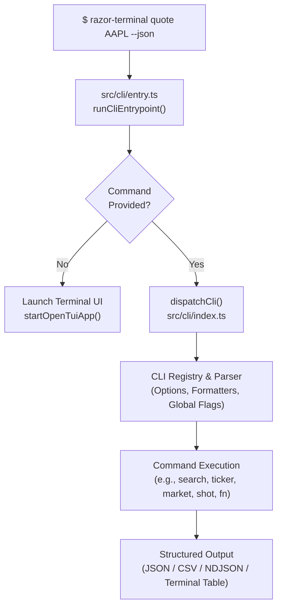

# 6. CLI, Headless Automation & Remote Control

## 6.1 CLI Architecture & Execution Flow

RazorTerminal features a headless CLI engine designed for automation, scripting, CI pipelines, and autonomous AI agents. Running `razor-terminal` with arguments executes the command in headless mode without launching a TUI or GUI window.



---

## 6.2 Global CLI Flags & Formatting Options

Every CLI command inherits a standard set of output and filtering flags:

| Flag | Purpose | Example |
| :--- | :--- | :--- |
| `--json` | Outputs raw, structured JSON model data. | `razor-terminal quote AAPL --json` |
| `--csv` | Formats tabular results as standard CSV. | `razor-terminal movers --csv` |
| `--ndjson` | Formats results as newline-delimited JSON (stream-friendly). | `razor-terminal news AAPL --ndjson` |
| `--limit <N>` | Restricts the number of rows or articles returned. | `razor-terminal news TSLA --limit 5` |
| `--no-color` | Disables ANSI color codes for plain text piping. | `razor-terminal ticker NVDA --no-color` |
| `--refresh` | Bypasses local SQLite cache to fetch fresh upstream data. | `razor-terminal financials MSFT --refresh` |
| `--yes` | Confirms destructive or trading actions automatically. | `razor-terminal broker sync --yes` |

---

## 6.3 Comprehensive CLI Command Reference

### 1. Market Data & Securities
- `razor-terminal quote <symbols>`: Fetch live/delayed quotes for one or more tickers.
- `razor-terminal search <query>`: Search company tickers, CIKs, and exchange listings.
- `razor-terminal ticker <symbol>`: Summary report containing quote, company profile, and key valuation multiples.
- `razor-terminal history <symbol>`: Historical price candles with configurable ranges (`1d`, `5d`, `1m`, `1y`, `5y`, `max`).
- `razor-terminal financials <symbol>`: Detailed balance sheets, income statements, and cash flows.
- `razor-terminal options <symbol>`: Real-time options chains, strikes, bids, asks, and implied volatilities.
- `razor-terminal news <symbol>`: Aggregated news articles and analyst headlines.
- `razor-terminal filings <symbol>`: SEC EDGAR filings (10-K, 10-Q, 8-K, Form 4).
- `razor-terminal holders <symbol>`: Institutional and insider ownership breakdowns.

### 2. Market Overview & Macro
- `razor-terminal movers`: Top gainers, losers, and most active stocks.
- `razor-terminal indices`: Major global indices (S&P 500, Nasdaq, Dow, FTSE, Nikkei).
- `razor-terminal sectors`: Performance breakdown across S&P sectors.
- `razor-terminal fx`: Currency exchange matrix (EUR, USD, JPY, GBP, etc.).
- `razor-terminal fear-greed`: Current CNN Fear & Greed Index score and historical ratings.
- `razor-terminal earnings`: Upcoming and recent earnings calendar.
- `razor-terminal econ`: Key economic indicators (CPI, Non-Farm Payrolls, GDP, Interest Rates).
- `razor-terminal yield-curve`: US Treasury yield curve maturities (1M to 30Y).

### 3. Portfolio, Watchlists & Notes
- `razor-terminal portfolio [list|add|remove|show]`: Manage local investment portfolios.
- `razor-terminal watchlist [list|add|remove]`: Manage custom ticker watchlists.
- `razor-terminal notes [list|view|edit]`: Read and write company research notes.
- `razor-terminal alerts [list|add|check]`: Manage price alerts.

### 4. AI & Advanced Analytics
- `razor-terminal ai ask "<prompt>"`: Query local or configured cloud AI providers (OpenAI, Anthropic, Gemini, Ollama).
- `razor-terminal ai screen "<criteria>"`: Run AI-powered stock screening prompts.

---

## 6.4 Headless Pane Screenshots & Functions

RazorTerminal allows headless rendering of interactive UI panes:

### Pane Screenshots (`razor-terminal shot`)
Captures an exact render of any UI pane without opening a window:
```bash
# Capture ASCII/ANSI terminal representation
razor-terminal shot DES AAPL

# Capture raster PNG screenshot via headless desktop renderer
razor-terminal shot HM --format png --output heatmap.png
```

### Pane Functions (`razor-terminal fn`)
Executes internal data transformation functions registered by specific panes:
```bash
razor-terminal fn kelly-sizer calculate --ticker AAPL --bankroll 100000 --prob 0.65 --odds 2.0
```

---

## 6.5 Remote Control Protocol & Semantic Tree

When RazorTerminal runs in UI mode, it automatically starts a local WebSocket **Remote Control Server** ([`src/remote/server.ts`](file:///c:/Users/patil/OneDrive/Desktop/zzz/src/remote/server.ts)).

### Capabilities:
1. **JSON-Patch Delta Sync**: Exposes the live `AppState` to external clients with sub-millisecond deltas.
2. **Semantic UI Tree Inspection**: External programs or test runners can inspect the hierarchy of rendered `<Box>`, `<Text>`, and `<Input>` components.
3. **Action Dispatching**: External scripts can trigger navigation, change selected tickers, open dialogs, or invoke command bar queries programmatically.

---

*Next: Read [**7. Developer & Modification Guide**](./DEVELOPMENT_GUIDE.md) to set up your environment, build, and extend the codebase.*
