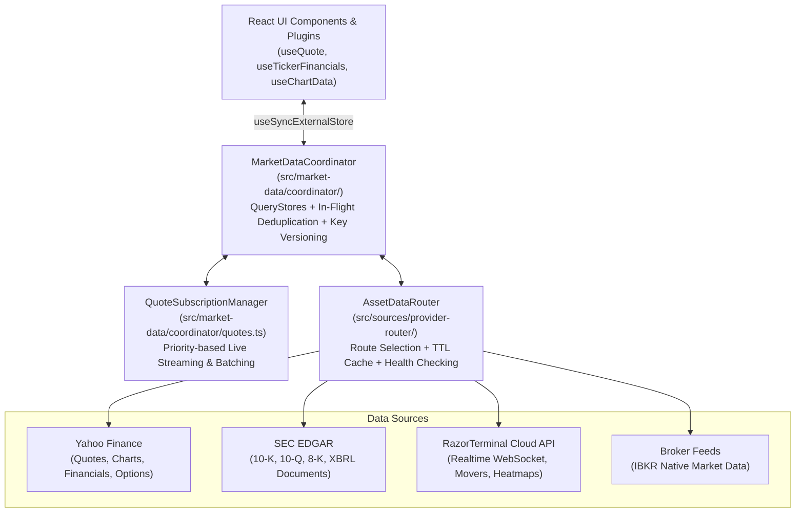

# 3. Market Data & Feeds Architecture

## 3.1 Overview & Mental Model

Financial applications demand high data throughput, low latency, robust caching, and graceful fallback across disparate upstream APIs. RazorTerminal implements a multi-tiered market data pipeline that coordinates REST APIs, WebSockets, background batch polling, and SQLite disk caches into a unified, reactive interface.



---

## 3.2 The `MarketDataCoordinator`

The **[`MarketDataCoordinator`](file:///c:/Users/patil/OneDrive/Desktop/zzz/src/market-data/coordinator/index.ts)** is the central reactive orchestrator for all market data in the application.

### Key Architectural Characteristics:

1. **Granular Reactive `QueryStore`s**: Instead of a monolithic cache, the coordinator maintains dedicated stores for each entity type:
   - `quoteStore`: Real-time and delayed quotes.
   - `snapshotStore`: Complete financial snapshots (`TickerFinancials`).
   - `profileStore`, `fundamentalsStore`, `statementsStore`: Granular company profile and financial statements.
   - `chartStore`: Time-series OHLCV price points (`PricePoint[]`).
   - `optionsStore`: Options chains and Greeks.
   - `secFilingsStore`, `secDocumentsStore`, `secContentStore`: SEC filings and parsed filing text.
   - `articleSummaryStore`: AI-generated news article summaries.
   - `fxStore`: Foreign exchange rates.

2. **In-Flight Deduplication**: The coordinator tracks active network requests via `inFlight: Map<string, Promise<unknown>>`. If multiple panes request the same chart or financial statement simultaneously, only a single network fetch is issued, and all callers await the shared Promise.

3. **Key-Level External Subscriptions**: The coordinator integrates with React 18/19's `useSyncExternalStore` via key-level version counters:
   - When a specific key changes (e.g. `quote:AAPL`), only subscribers to that specific key re-render.
   - Bumps are batched using microtasks to prevent re-render thrashing during rapid streaming ticks.

---

## 3.3 Quote Subscriptions & Batch Management

The **[`QuoteSubscriptionManager`](file:///c:/Users/patil/OneDrive/Desktop/zzz/src/market-data/coordinator/quotes.ts)** optimizes network and CPU utilization by categorizing ticker subscriptions into priority tiers:

- **Active / Visible Tickers (`priority: 1`)**: Fast polling or live WebSocket streaming (updated every 1–2 seconds or upon every stream tick).
- **Background Watchlist Tickers (`priority: 2`)**: Batch-polled at lower frequencies (e.g. every 15–60 seconds).
- **Inactive / Off-Screen Tickers**: Unsubscribed automatically when UI unmounts or leaves viewport.

---

## 3.4 Data Sources & `AssetDataRouter`

The **[`AssetDataRouter`](file:///c:/Users/patil/OneDrive/Desktop/zzz/src/sources/provider-router/index.ts)** implements smart provider routing, multi-source fallbacks, and connection health management:

### 1. Yahoo Finance Provider ([`src/sources/yahoo-finance/`](file:///c:/Users/patil/OneDrive/Desktop/zzz/src/sources/yahoo-finance/))
- Fetches real-time/delayed equity, ETF, crypto, FX, and index quotes.
- Loads historical price candles with adaptive intervals (1m, 5m, 15m, 1d, 1wk, 1mo).
- Parses income statements, balance sheets, and cash flow statements.
- Fetches real-time options chains with implied volatility and strike ladders.

### 2. SEC EDGAR Provider ([`src/sources/sec-edgar/`](file:///c:/Users/patil/OneDrive/Desktop/zzz/src/sources/sec-edgar/))
- Interfaces directly with SEC EDGAR REST APIs.
- Queries company CIK mappings, company submissions, and accession numbers.
- Extracts and strips HTML/XBRL filings for 10-K (Annual), 10-Q (Quarterly), 8-K (Current Events), and Form 4 (Insider Transactions).

### 3. RazorTerminal Cloud Provider ([`src/sources/razor-terminal-cloud/`](file:///c:/Users/patil/OneDrive/Desktop/zzz/src/sources/razor-terminal-cloud/))
- Provides authenticated WebSocket streaming for Pro users.
- Supplies market-wide aggregated feeds: Market Heatmap (`HM`), Market Movers (`MOST`), Fear & Greed Index, New Highs/Lows (`HILO`), and Economic Calendar (`ECON`).

---

## 3.5 React Hooks for Data Access

Plugins and UI components consume market data using the typed React hooks defined in [`src/market-data/hooks.tsx`](file:///c:/Users/patil/OneDrive/Desktop/zzz/src/market-data/hooks.tsx):

```tsx
import { useQuote, useTickerFinancials, useChartData } from "razor-terminal/market-data";

export function StockOverview({ symbol }: { symbol: string }) {
  // 1. Subscribe to live quote updates
  const { quote, loading: quoteLoading, error: quoteError } = useQuote(symbol);

  // 2. Fetch full financials (statements, profile, valuation ratios)
  const { financials, loading: finLoading } = useTickerFinancials(symbol);

  // 3. Request historical chart candles
  const { points, loading: chartLoading } = useChartData({
    instrument: { symbol, exchange: "NASDAQ" },
    range: "1Y",
    interval: "1d",
  });

  if (quoteLoading) return <Text>Loading quote...</Text>;

  return (
    <Box flexDirection="column">
      <Text bold>{symbol}: ${quote?.price?.toFixed(2)}</Text>
      <Text color={quote?.change && quote.change >= 0 ? "green" : "red"}>
        {quote?.changePercent?.toFixed(2)}%
      </Text>
    </Box>
  );
}
```

---

*Next: Read [**4. Plugin System & Extensibility**](./PLUGIN_SYSTEM.md) to learn how to build panes, commands, and custom plugins.*
