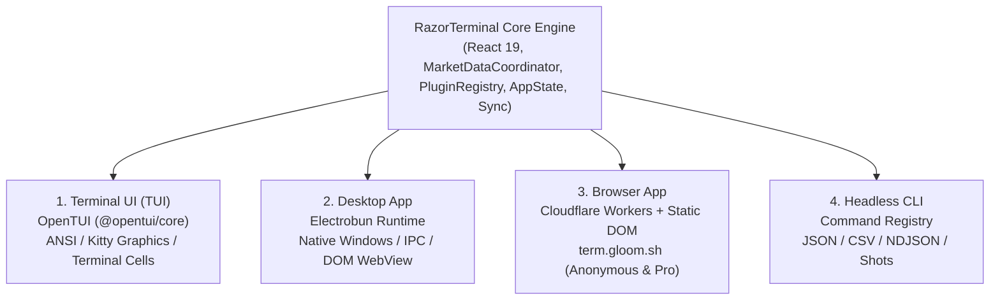
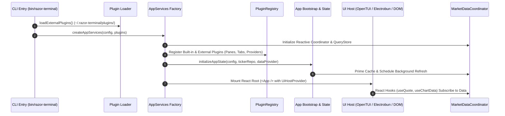

# 1. RazorTerminal System Overview

## 1.1 What is RazorTerminal?

**RazorTerminal** is a modern, fast, keyboard-driven financial terminal and research platform. Designed with inspiration from professional workstations (like Bloomberg and FactSet), it offers real-time quotes, technical charts, fundamentals, SEC filings, options chains, portfolio tracking, broker position sync, news feeds, macro indicators, and AI screening—all accessible via keyboard shortcuts or CLI commands.

---

## 1.2 The Multi-Surface Architecture

RazorTerminal has a **Single Core, Multi-Surface** architecture. The business logic, state machines, market data coordinator, and UI component trees are written once in React and TypeScript, running across four distinct surfaces:

### 1. Terminal UI (TUI)
- **Engine**: `@opentui/core` and `@opentui/react`.
- **Target**: Runs inside any standard terminal (Ghostty, Kitty, WezTerm, iTerm2, Windows Terminal).
- **Features**: Direct terminal cell rendering, Kitty graphics protocol for pixel-perfect charts/images (falling back to braille/half-block charts), sub-millisecond keyboard response.
- **Entry point**: [`src/index.tsx`](file:///c:/Users/patil/OneDrive/Desktop/zzz/src/index.tsx) -> [`src/renderers/opentui/start.tsx`](file:///c:/Users/patil/OneDrive/Desktop/zzz/src/renderers/opentui/start.tsx).

### 2. Desktop Application
- **Engine**: [Electrobun](https://electrobun.dev), a lightweight, high-performance alternative to Electron built on Bun and native webviews.
- **Target**: macOS (.app / Homebrew Cask) and Windows (x64 / ARM64 installer).
- **Features**: Native OS windows, detachable/pop-out panes, OS-level application menus, native context menus, local broker integrations, automatic background updates.
- **Entry points**:
  - Main Bun process: [`src/renderers/electrobun/bun/index.ts`](file:///c:/Users/patil/OneDrive/Desktop/zzz/src/renderers/electrobun/bun/index.ts)
  - WebView UI process: [`src/renderers/electrobun/view/main.tsx`](file:///c:/Users/patil/OneDrive/Desktop/zzz/src/renderers/electrobun/view/main.tsx)

### 3. Browser Web App
- **Engine**: Standard browser DOM + Cloudflare Workers edge backend.
- **Target**: Accessible online at [term.gloom.sh](https://term.gloom.sh).
- **Features**: Zero-install terminal experience, browser `localStorage` persistence, rate-limited delayed cloud market data for anonymous users, real-time data and session sync for authenticated users. Intentionally omits native broker integrations and filesystem notes.
- **Entry points**: [`src/renderers/browser/main.tsx`](file:///c:/Users/patil/OneDrive/Desktop/zzz/src/renderers/browser/main.tsx), [`src/renderers/cloudflare/worker.ts`](file:///c:/Users/patil/OneDrive/Desktop/zzz/src/renderers/cloudflare/worker.ts).

### 4. Headless CLI & Automation
- **Engine**: Lightweight headless command dispatch.
- **Target**: Scripts, CI/CD, agent workflows, cron jobs, and terminal pipes.
- **Features**: Fast execution without launching any UI window, rich structured outputs (`--json`, `--csv`, `--ndjson`), pane-backed screenshots (`razor-terminal shot <pane>`), and pane function invocation (`razor-terminal fn <pane> <fn>`).
- **Entry point**: [`src/cli/entry.ts`](file:///c:/Users/patil/OneDrive/Desktop/zzz/src/cli/entry.ts) -> [`src/cli/index.ts`](file:///c:/Users/patil/OneDrive/Desktop/zzz/src/cli/index.ts).

---

## 1.3 Core Execution Lifecycle

When RazorTerminal boots, it executes the following unified lifecycle:

1. **Argument Parsing & Dispatch**: [`src/cli/entry.ts`](file:///c:/Users/patil/OneDrive/Desktop/zzz/src/cli/entry.ts) inspects `process.argv`. If a headless CLI command was invoked (e.g. `razor-terminal quote AAPL`), it dispatches directly; otherwise, it boots the interactive UI.
2. **Plugin Discovery**: External plugins are loaded asynchronously from `~/.razor-terminal/plugins/` alongside the 50+ built-in plugins.
3. **AppServices Initialization**: [`createAppServices()`](file:///c:/Users/patil/OneDrive/Desktop/zzz/src/core/app-services.ts) initializes:
   - `AppPersistence` (SQLite cache on disk)
   - `TickerRepository` (tracked securities database)
   - `AssetDataRouter` (multi-source data aggregator)
   - `MarketDataCoordinator` (reactive query store & quote subscriptions)
   - `PluginRegistry` (component and capability catalog)
   - `NewsService` (aggregated news engine)
4. **State Bootstrap**: [`initializeAppState()`](file:///c:/Users/patil/OneDrive/Desktop/zzz/src/state/app/bootstrap.ts) seeds pane state cursors, restores the previous session snapshot, loads active portfolios/watchlists, and prioritizes data fetching.
5. **UI Host Mounting**: The UI renderer wraps [`<App />`](file:///c:/Users/patil/OneDrive/Desktop/zzz/src/app.tsx) in a [`<UiHostProvider>`](file:///c:/Users/patil/OneDrive/Desktop/zzz/src/ui/host.tsx), mapping renderer-neutral components (`<Box>`, `<Text>`, `<ChartSurface>`) to platform-specific widgets.

---

## 1.4 Directory Map

| Path | Purpose & Responsibilities |
| :--- | :--- |
| [`src/app.tsx`](file:///c:/Users/patil/OneDrive/Desktop/zzz/src/app.tsx) | Top-level React application root, global shortcuts, dialog host, toast viewport, command bar |
| [`src/core/`](file:///c:/Users/patil/OneDrive/Desktop/zzz/src/core/) | Core runtime contracts (`app-service-ports.ts`), container factory (`app-services.ts`), connection health monitor |
| [`src/ui/`](file:///c:/Users/patil/OneDrive/Desktop/zzz/src/ui/) | Renderer-neutral UI layer: `<Box>`, `<Text>`, `<Highlight>`, `<Dialog>`, `<ContextMenu>`, `<Toast>` |
| [`src/renderers/`](file:///c:/Users/patil/OneDrive/Desktop/zzz/src/renderers/) | Target render hosts: `opentui/` (Terminal), `electrobun/` (Desktop), `browser/` (Web DOM), `cloudflare/` (Edge Worker) |
| [`src/market-data/`](file:///c:/Users/patil/OneDrive/Desktop/zzz/src/market-data/) | Reactive data layer: `MarketDataCoordinator`, `QueryStore`, real-time quote streaming manager, React hooks (`hooks.tsx`) |
| [`src/sources/`](file:///c:/Users/patil/OneDrive/Desktop/zzz/src/sources/) | Data ingestion adapters: `provider-router/`, `yahoo-finance/`, `sec-edgar/`, `razor-terminal-cloud/` |
| [`src/plugins/`](file:///c:/Users/patil/OneDrive/Desktop/zzz/src/plugins/) | Plugin engine (`registry/`, `loader.ts`, `pane-manager/`) + 50+ built-in feature plugins (`builtin/`) |
| [`src/state/`](file:///c:/Users/patil/OneDrive/Desktop/zzz/src/state/) | State management: React AppContext, Reducers, persistence scheduler, scroll registry, bootstrap logic |
| [`src/brokers/`](file:///c:/Users/patil/OneDrive/Desktop/zzz/src/brokers/) | Broker connectors & position synchronizers: Interactive Brokers (IBKR), Robinhood, Public, SimpleFIN |
| [`src/sync/`](file:///c:/Users/patil/OneDrive/Desktop/zzz/src/sync/) | Multi-client cloud synchronization engine (`CloudSyncController`), contributors, conflict-free merge |
| [`src/cli/`](file:///c:/Users/patil/OneDrive/Desktop/zzz/src/cli/) | Headless CLI command definitions, option parsers, table formatters, pane screenshot and function runner |
| [`src/remote/`](file:///c:/Users/patil/OneDrive/Desktop/zzz/src/remote/) | Remote Control WebSocket server, Semantic UI node tree, and JSON-Patch delta protocol |
| [`src/components/`](file:///c:/Users/patil/OneDrive/Desktop/zzz/src/components/) | Shared UI components: Command bar, charts, data tables, markdown editor, onboarding wizard |
| [`src/types/`](file:///c:/Users/patil/OneDrive/Desktop/zzz/src/types/) | Core TypeScript type contracts for configuration, plugins, financials, instruments, and brokers |

---

*Next: Read [**2. Architecture & Renderers**](./ARCHITECTURE.md) to understand the UI abstraction and rendering engines in depth.*
