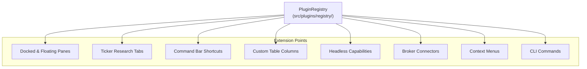

# 4. Plugin System & Extensibility Guide

## 4.1 The Plugin Architecture

In RazorTerminal, **everything is a plugin**. Features such as the Portfolio tracker, Ticker Research workstation, News aggregator, Market Heatmap, Options chains, and AI screeners are all implemented as plugins on top of the core runtime.



Plugins can be either:
- **Built-in Plugins** ([`src/plugins/builtin/`](file:///c:/Users/patil/OneDrive/Desktop/zzz/src/plugins/builtin/)): Shipped with the core application.
- **External Plugins**: Loaded dynamically at runtime from `~/.razor-terminal/plugins/<plugin-id>/index.ts` or installed via `razor-terminal install <user/repo>`.

---

## 4.2 The `RazorTerminalPlugin` Contract

A plugin implements the [`RazorTerminalPlugin`](file:///c:/Users/patil/OneDrive/Desktop/zzz/src/types/plugin.ts) interface:

```typescript
import type { RazorTerminalPlugin, PluginContext } from "razor-terminal/types/plugin";

export const myPlugin: RazorTerminalPlugin = {
  id: "my-custom-plugin",
  name: "My Custom Plugin",
  version: "1.0.0",
  description: "Adds custom analytics and panes",
  toggleable: true, // Allows user to toggle on/off in settings

  // 1. Declarative headless capabilities
  capabilities: [
    // Headless data providers or services
  ],

  // 2. CLI commands accessible via `razor-terminal <cmd>`
  cli: {
    commands: [
      {
        name: "my-cmd",
        description: "Run custom plugin CLI logic",
        async execute(args, ctx) {
          ctx.printResult({ data: { status: "ok", args } });
        },
      },
    ],
  },

  // 3. Interactive runtime setup
  setup(ctx: PluginContext) {
    // Register panes, tabs, shortcuts, context menus
  },

  // 4. Teardown
  dispose() {
    // Clean up timers or long-running listeners
  },
};

export default myPlugin;
```

---

## 4.3 Extension Registration Methods

The `setup(ctx)` function receives a rich `PluginContext` providing access to the following registration methods:

### 1. Register a Pane (`ctx.registerPane`)
Adds a primary window pane that can be docked on the left/right or floated as a detached window.

```tsx
ctx.registerPane({
  id: "my-analytics-pane",
  name: "My Analytics",
  icon: "chart",
  defaultPosition: "right",
  defaultWidth: "50%",
  component: ({ paneId, focused, width, height, close }) => {
    return (
      <Box flexDirection="column" padding={1}>
        <Text bold color="cyan">Analytics View</Text>
        <Text>Dimensions: {width} x {height}</Text>
      </Box>
    );
  },
});
```

### 2. Register a Ticker Research Tab (`ctx.registerTickerResearchTab`)
Extends the central `DES` (Security Details) workstation pane with an additional analysis tab.

```tsx
ctx.registerTickerResearchTab({
  id: "my-tab",
  title: "Sentiment",
  order: 50,
  component: ({ ticker, financials }) => {
    return (
      <Box flexDirection="column">
        <Text bold>Sentiment Analysis for {ticker.metadata.ticker}</Text>
      </Box>
    );
  },
});
```

### 3. Register a Command Bar Shortcut (`ctx.registerCommand`)
Binds a keyword shortcut in the global Command Bar (`Ctrl+P` / `` ` ``).

```typescript
ctx.registerCommand({
  id: "open-my-pane",
  label: "ANALYTICS: Open custom analytics pane",
  shortcut: "ANALYTICS",
  execute: () => {
    ctx.openPane("my-analytics-pane");
  },
});
```

### 4. Register a Table Column (`ctx.registerColumn`)
Adds custom data columns to the Portfolio and Watchlist data tables.

```typescript
ctx.registerColumn({
  id: "my_score",
  name: "Score",
  width: 8,
  align: "right",
  getValue: (ticker, financials) => {
    return financials?.fundamentals?.returnOnEquity ? `${(financials.fundamentals.returnOnEquity * 100).toFixed(1)}%` : "—";
  },
});
```

### 5. Register Context Menus (`ctx.registerContextMenuProvider`)
Adds renderer-neutral context menu items to tickers, panes, or links across Desktop and Terminal.

```typescript
ctx.registerContextMenuProvider({
  id: "my-ticker-actions",
  contexts: ["ticker"],
  getItems: (context) => {
    if (context.kind !== "ticker") return null;
    return [
      {
        id: "open-sentiment",
        label: `View ${context.symbol} Sentiment`,
        onSelect: () => ctx.openCommandBar(`ANALYTICS ${context.symbol}`),
      },
    ];
  },
});
```

---

## 4.4 Step-by-Step Tutorial: Building a New Plugin

Let's walk through building a complete plugin named **Crypto Correlations (`crypto-corr`)**:

### Step 1: Create the Plugin Folder
Create `src/plugins/builtin/crypto-corr/` (or `~/.razor-terminal/plugins/crypto-corr/` for external).

### Step 2: Implement the Plugin Component
Create `src/plugins/builtin/crypto-corr/pane.tsx`:
```tsx
import { Box, Text } from "../../../ui";
import { useQuote } from "../../../market-data";

export function CryptoCorrPane({ focused }: { focused: boolean }) {
  const { quote: btcQuote } = useQuote("BTC-USD");
  const { quote: ethQuote } = useQuote("ETH-USD");

  return (
    <Box flexDirection="column" padding={1}>
      <Text bold color="yellow">Crypto Correlation Matrix</Text>
      <Text>BTC: ${btcQuote?.price?.toLocaleString() ?? "Loading..."}</Text>
      <Text>ETH: ${ethQuote?.price?.toLocaleString() ?? "Loading..."}</Text>
    </Box>
  );
}
```

### Step 3: Implement the Plugin Definition
Create `src/plugins/builtin/crypto-corr/index.ts`:
```typescript
import type { RazorTerminalPlugin } from "../../../types/plugin";
import { CryptoCorrPane } from "./pane";

export const cryptoCorrPlugin: RazorTerminalPlugin = {
  id: "crypto-corr",
  name: "Crypto Correlation",
  version: "1.0.0",
  description: "Track cryptocurrency price correlation matrix",
  toggleable: true,

  setup(ctx) {
    ctx.registerPane({
      id: "crypto-corr-pane",
      name: "Crypto Correlation",
      icon: "zap",
      defaultPosition: "right",
      component: (props) => <CryptoCorrPane focused={props.focused} />,
    });

    ctx.registerCommand({
      id: "cmd-crypto-corr",
      label: "CC: Open Crypto Correlation Pane",
      shortcut: "CC",
      execute: () => ctx.openPane("crypto-corr-pane"),
    });
  },
};

export default cryptoCorrPlugin;
```

### Step 4: Register in the Catalog
Add `cryptoCorrPlugin` to [`src/plugins/builtin/composite-plugins.ts`](file:///c:/Users/patil/OneDrive/Desktop/zzz/src/plugins/builtin/composite-plugins.ts). The plugin is now fully available in the terminal UI, desktop app, and command bar!

---

*Next: Read [**5. State, Persistence & Cloud Sync**](./STATE_PERSISTENCE_SYNC.md) to understand state management, storage, and broker sync.*
