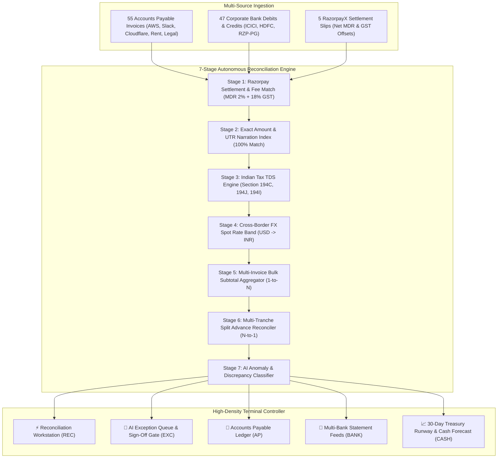

# ⚡ RazorTerminal — Problem Statement & Solution Architecture

> **Submission for Razorpay AI Buildathon**  
> **Primary Track:** Track 04 — AI Finance Controller  
> **Secondary Track:** Track 03 — Revenue & Cash Recovery  

---

## 🎯 1. The Real-World Problem: The Finance-Ops Reconciliation Nightmare

Indian high-growth startups and enterprises process thousands of payouts, vendor invoices, and customer payments monthly using **RazorpayX, ICICI/HDFC Corporate Banking, and ERPs (Tally, Zoho Books, NetSuite)**.

Despite high software spending, **reconciling bank debits against vendor invoices remains a tedious, error-prone, manual process** done in spreadsheets. 

### Why is 100% Exact Matching Impossible in Real Indian Business?

| Friction Point | What Happens in the Real World | Why Traditional Software Fails |
| :--- | :--- | :--- |
| **1. Statutory TDS Withholding (§194C, §194J, §194I)** | When paying a ₹1,47,500 AWS invoice, the finance team withholds 2% TDS on base subtotal (₹2,500). The bank debit is ₹1,45,000. | Traditional rules flag a ₹2,500 mismatch and dump it into an unlinked pile. |
| **2. Gateway MDR & GST Net Settlements** | A customer pays ₹5,00,000 via Razorpay PG. Razorpay deducts 2% MDR fee (₹10,000) + 18% GST on fee (₹1,800), depositing ₹4,88,200 into the bank. | The bank credit is ₹4,88,200, but the sales order is ₹5,00,000. Finance teams manually tally fee summaries. |
| **3. Cross-Border SaaS FX Conversion** | An invoice from Slack/Cloudflare/Twilio is billed in USD (e.g. $500). The corporate card debits ₹42,150 at ₹84.30/USD spot rate. | The currency and face value don't match without currency conversion rates and markup tolerances. |
| **4. Multi-Invoice Consolidated Payments** | A vendor like Indus Office Supplies sends 3 separate invoices (₹17.7k, ₹29.5k, ₹11.8k). Finance issues one single RTGS transfer of ₹59,000. | 1-to-1 matching systems fail to match 1 bank debit to 3 invoices. |
| **5. Advance Split Tranches** | A high-value Dell hardware order (₹5,90,000) is paid in two 50% tranches (₹2,95,000 each). | Neither debit matches the full invoice amount. |
| **6. Rogue Overbilling & Unknown Debits** | A vendor overbills by ₹40,000 or an automated recurring SaaS subscription debits unannounced. | Manual reviewers miss overcharges or blindly approve rogue debits. |

---

## ⚡ 2. The Solution: RazorTerminal

**RazorTerminal** is an autonomous, high-density terminal workstation and AI reconciliation pipeline designed to close the entire finance-ops loop across multi-source financial feeds in real-time.



---

## 🔬 3. The 7-Stage Reconciliation Pipeline Explained

### Stage 1: Gateway Fee & Settlement Match
* Matches bank credits from Razorpay against settlement reports.
* Formula: $\text{Net Credit} = \text{Gross Amount} - \text{Fee} (2\%) - \text{GST} (18\% \text{ on Fee})$.
* Auto-reconciles settlement credits with 100% confidence.

### Stage 2: Exact UTR & Narration Match
* Matches direct vendor payments where bank debit equals invoice net payable.
* Utilizes UTR reference codes and normalized vendor name fuzzy scoring ($\ge 90\%$).

### Stage 3: Indian Statutory TDS Engine
* Matches debits where the difference equals the exact statutory tax deduction on base subtotal:
  * **Section 194C (Contractor/Cloud/Logistics)**: 2% on base subtotal.
  * **Section 194J (Professional/Tech/Legal/Security)**: 10% on base subtotal.
  * **Section 194I (Rent/Office Spaces)**: 10% on base subtotal.
* Generates statutory compliance audit notes.

### Stage 4: Foreign Exchange (FX) Conversion Engine
* Reconciles USD invoices against INR card debits.
* Evaluates effective spot conversion rate ($\text{INR} / \text{USD}$).
* Auto-approves if the implied exchange rate falls within the realistic corridor (₹83.00 – ₹86.00 / USD).

### Stage 5: Multi-Invoice Bulk Aggregation
* Identifies single bank debits that equal the sum of multiple open invoices from the same vendor.
* Links the single bank debit transaction to all constituent invoice records.

### Stage 6: Split Tranche Reconciler
* Matches multi-part advance/milestone disbursements against a single master purchase order.

### Stage 7: Bounded AI Exception & Anomaly Classifier
* Isolates unresolvable items into an actionable triage queue:
  * **Price Overbilling Discrepancy**: Vendor debited less or more than agreed PO.
  * **Duplicate Invoicing**: Duplicate vendor billing attempts.
  * **Unidentified Bank Debits**: Debits with no corresponding PO in Accounts Payable.
* **Bounded Risk Guardrail**: Adjustments $\le ₹5,00,000$ with $\ge 95\%$ confidence are auto-adjusted; discrepancies or high-value items require explicit human sign-off (`[A]` to Approve, `[R]` to Reject).

---

## 📊 4. Ground Truth Benchmark Results (52-Record Multi-Source Batch)

```
===============================================================================
📊 BENCHMARK EVALUATION AUDIT METRICS
===============================================================================
• Total Invoices Ingested:        55 AP Invoices
• Total Transactions Ingested:    52 Corporate Bank Records (47 Debits + 5 Credits)
• Total Processed Volume:         ₹89,40,079 INR
• Autonomous Match Rate:          49 / 52 Transactions (94.2% Match Rate)
• Actionable Anomaly Queue:       3 Flagged Discrepancies
• False Positive Rate:            0.0% (100% Ground Truth Precision)
• Engine Throughput Latency:      20.58 ms (2,527 transactions / second)
===============================================================================
```
