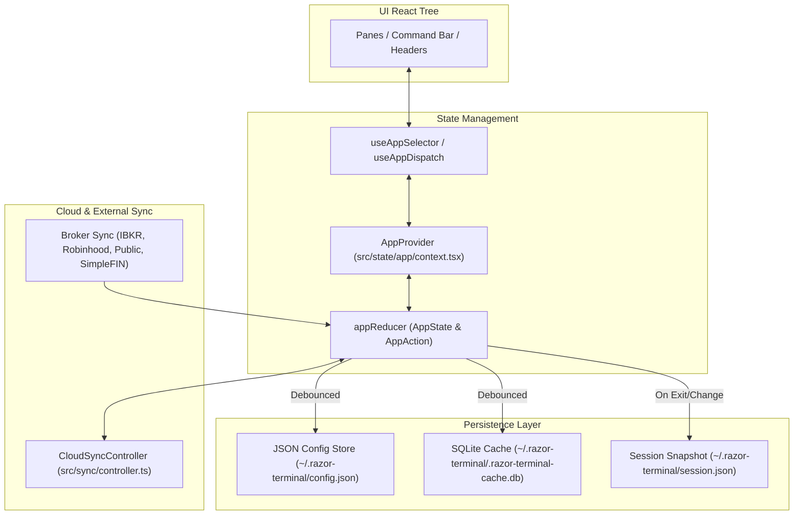
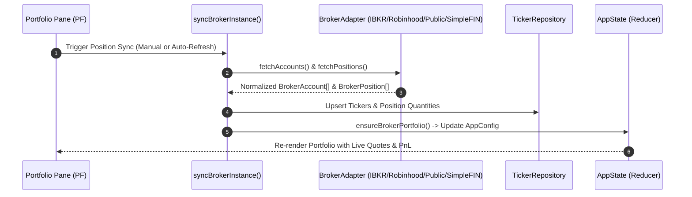

# 5. State Management, Persistence & Cloud Sync

## 5.1 Application State Architecture

RazorTerminal uses React's Context and `useReducer` paradigm supplemented by external reactive stores for high-frequency market data.

### Core State Slices (`AppState`)

Defined in [`src/state/app/context.tsx`](file:///c:/Users/patil/OneDrive/Desktop/zzz/src/state/app/context.tsx):

- **`config` (`AppConfig`)**: Portfolios, watchlists, active layout instances, broker instances, theme settings, refresh intervals, enabled plugins.
- **`tickers` (`TickerRecord[]`)**: Tracked tickers, portfolio holdings, cost basis, target weights, metadata.
- **`paneState` (`Record<string, Record<string, unknown>>`)**: Per-pane runtime state (cursor positions, selected rows, active sub-tabs, filter queries).
- **`focusedPaneId` (`string | null`)**: ID of the currently focused pane receiving keyboard inputs.
- **`commandBarOpen` (`boolean`)**: Visibility of the quick-action command palette.
- **`inputCaptured` (`boolean`)**: Flag indicating whether an active text box or dialog has captured keyboard input.
- **`syncStatus` (`CloudSyncStatus`)**: Real-time phase (`idle`, `syncing`, `synced`, `error`) and revision numbers.

---

## 5.2 Persistence & Storage Layer

RazorTerminal separates fast-changing cache data from user configurations:

### 1. JSON Configuration Store ([`src/data/config/store/`](file:///c:/Users/patil/OneDrive/Desktop/zzz/src/data/config/store/))
- **File**: `~/.razor-terminal/config.json`
- **Contents**: Layout trees, custom themes, portfolio structures, broker instance credentials/tokens, and user preferences.
- **Scheduler**: Writes are debounced via [`scheduleConfigSave()`](file:///c:/Users/patil/OneDrive/Desktop/zzz/src/state/config-save-scheduler.ts) to prevent excessive disk I/O.

### 2. SQLite Cache Database ([`src/data/app-persistence.ts`](file:///c:/Users/patil/OneDrive/Desktop/zzz/src/data/app-persistence.ts))
- **File**: `~/.razor-terminal/.razor-terminal-cache.db` (powered by `bun:sqlite`).
- **Tables**:
  - `tickers`: Ticker metadata, company details, market caps, sector classifications.
  - `resources`: Generic key-value cache with TTLs for plugin state, historical data, and XBRL documents.

### 3. Session Persistence ([`src/core/state/session-persistence.ts`](file:///c:/Users/patil/OneDrive/Desktop/zzz/src/core/state/session-persistence.ts))
- Preserves the exact cursor positions, active tabs, and layout state across application restarts so the user returns to their exact workspace setup.

---

## 5.3 Cloud Synchronization Engine

The **[`CloudSyncController`](file:///c:/Users/patil/OneDrive/Desktop/zzz/src/sync/controller.ts)** allows users with RazorTerminal Cloud accounts to synchronize layouts, watchlists, notes, and alerts across multiple devices.

### Contributor Model:
Sync payload generation is modularized using **Contributors** ([`src/sync/core-contributors.ts`](file:///c:/Users/patil/OneDrive/Desktop/zzz/src/sync/core-contributors.ts)):

1. `portfolios`: Synchronizes manual portfolio names, tickers, quantities, and cost basis.
2. `watchlists`: Synchronizes custom watchlist collections.
3. `layout`: Synchronizes pane positions, docking arrangements, and sizes.
4. `notes`: Synchronizes markdown research notes.
5. `alerts`: Synchronizes price and technical alerts.

### Sync Workflow:
1. **Change Detection**: When local state updates, contributors compute a deterministic hash signature (`snapshotContentSignature`).
2. **Debounced Push**: If the signature changes, a push is scheduled (debounced by 2.5 seconds).
3. **Optimistic Merging**: Incoming revisions from RazorTerminal Cloud are diffed against the local baseline and merged conflict-free without interrupting active UI sessions.

---

## 5.4 Broker Integrations & Position Synchronization

RazorTerminal can securely synchronize investment portfolios and equity positions from external brokerages ([`src/brokers/`](file:///c:/Users/patil/OneDrive/Desktop/zzz/src/brokers/)):

### Supported Broker Connectors:
- **Interactive Brokers (IBKR)** ([`src/plugins/ibkr/`](file:///c:/Users/patil/OneDrive/Desktop/zzz/src/plugins/ibkr/)): Connects via Client Portal REST gateway or local TWS socket (`@stoqey/ib`).
- **Robinhood**: Interfaces through the Robinhood Trading Model Context Protocol (MCP) server.
- **Public.com**: Authenticates with short-lived API tokens and queries equity/crypto holdings.
- **SimpleFIN**: Uses open banking setup tokens to import multi-institution holdings.

---

*Next: Read [**6. CLI, Headless & Remote Control**](./CLI_AND_HEADLESS.md) to explore automation and remote control capabilities.*
