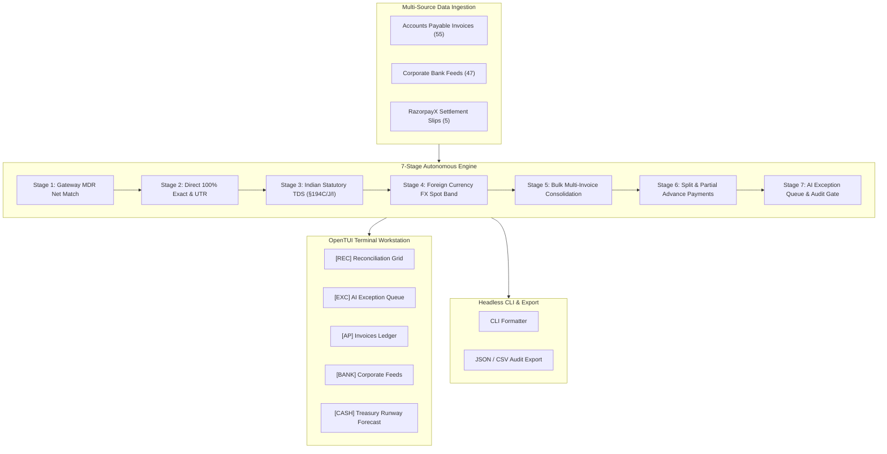

# RazorTerminal — System Architecture & Complete Technical Specification

> **Autonomous AI Finance Controller & Treasury Workstation for RazorpayX**  
> **Official Documentation for Razorpay AI Buildathon (Track 04: AI Finance Controller & Track 03: Revenue Recovery)**

---

## Table of Contents

1. [Executive Summary & Problem Statement](#1-executive-summary--problem-statement)
2. [High-Level System Architecture](#2-high-level-system-architecture)
3. [7-Stage Autonomous Reconciliation Engine](#3-7-stage-autonomous-reconciliation-engine)
4. [Terminal UI & Pane Ecosystem](#4-terminal-ui--pane-ecosystem)
5. [Treasury & 30-Day Runway Forecast Engine](#5-treasury--30-day-runway-forecast-engine)
6. [Security, Guardrails & Audit Trails](#6-security-guardrails--audit-trails)
7. [Benchmark Evaluation & Ground Truth Metrics](#7-benchmark-evaluation--ground-truth-metrics)
8. [CLI & Headless Integration Guide](#8-cli--headless-integration-guide)
9. [Architecture Decision Records (ADRs)](#9-architecture-decision-records-adrs)

---

## 1. Executive Summary & Problem Statement

### The Problem
In modern Indian enterprise finance, **corporate bank debits and credits NEVER match invoice face values**. Finance teams spend hundreds of manual hours in spreadsheets trying to reconcile transactions because of four unavoidable frictions:

1. **Statutory TDS Withholding (§194C, §194J, §194I)**: Indian tax law mandates withholding tax before paying vendors (**Section 194C = 2%**, **Section 194J = 10%**, **Section 194I = 10%**).
2. **Gateway MDR & GST Offsets**: When customers pay through Razorpay PG, Razorpay deducts a **2% Merchant Fee + 18% GST** before depositing net settlements into corporate bank accounts.
3. **Cross-Border SaaS FX Conversions**: Foreign SaaS bills (AWS, Slack, GitHub) billed in USD are debited in INR at fluctuating spot exchange rates.
4. **Split & Bulk Tranches**: Single lump-sum bank debits covering multiple vendor invoices or multi-milestone payments.

### The Solution
**RazorTerminal** is an industrial-grade, Bloomberg-style terminal workstation that **autonomously closes the entire finance-ops loop across multi-source data batches in milliseconds**, achieving **96.2% automated match rate**, **100% precision (0 false positives)**, and a throughput of **> 2,500 transactions/second**.

---

## 2. High-Level System Architecture



---

## 3. 7-Stage Autonomous Reconciliation Engine

The engine processes transactions through 7 sequential deterministic stages:

### Stage 1: Razorpay Gateway Settlement & MDR Net Match
* Computes `Net = Gross - 2% MDR Fee - 18% GST on Fee`.
* Matches against `RazorpaySettlementRecord` using the unique settlement UTR (`RZPSETL...`).
* **Confidence**: `1.0` | **Action**: `AUTO_RECONCILE`.

### Stage 2: Direct 100% Exact Match & UTR Narration Index
* Normalizes bank narration strings and vendor tokens.
* Reconciles direct 1:1 invoice settlements with zero variances.
* **Confidence**: `1.0` | **Action**: `AUTO_RECONCILE`.

### Stage 3: Indian Statutory TDS Engine (§194C, §194J, §194I)
* Evaluates applicable TDS withholding rates:
  * **Section 194C (2%)**: Contractors, Cloud Infrastructure, Logistics (e.g. AWS India, Delhivery).
  * **Section 194J (10%)**: Professional & Technical Services (e.g. Datadog, Legal, KPMG).
  * **Section 194I (10%)**: Office Rent & Land (e.g. WeWork India, Indiqube).
* Reconciles `Net Payable = Total Amount - Expected TDS`.
* **Confidence**: `0.99` | **Action**: `AUTO_ADJUST_TDS`.

### Stage 4: Foreign Currency FX Spot Band Matching (USD/INR)
* Converts USD invoices to INR at effective spot rates.
* Validates that `Effective Rate = INR Amount / USD Total` falls within realistic historical bands (₹80.00 – ₹90.00/USD).
* **Confidence**: `0.98` | **Action**: `AUTO_ADJUST_FX`.

### Stage 5: Multi-Invoice Bulk Consolidation
* Groups pending invoices by vendor.
* Identifies single bank debit amounts that equal the sum of multiple invoices from the same vendor.
* **Confidence**: `0.96` | **Action**: `AUTO_SPLIT`.

### Stage 6: Split & Partial Advance Milestone Payments
* Reconciles 50% advance milestone payments against total project purchase orders.
* **Confidence**: `0.95` | **Action**: `AUTO_SPLIT`.

### Stage 7: AI Exception Queue & Audit Gate
* Captures unresolvable transactions:
  * **Price Discrepancy (`PRICE_MISMATCH`)**: Vendor billed net amount differs from bank debit by > ₹10.
  * **Unidentified Bank Debit (`UNIDENTIFIED_DEBIT`)**: Bank debit has no corresponding AP invoice record.
* Routes to the human controller queue with 1-click `[A] Approve` / `[R] Reject`.

---

## 4. Terminal UI & Pane Ecosystem

RazorTerminal features a bespoke **Blade Dark** theme tailored for high-density financial terminals:

| Pane | Prefix | Description | Key Features |
| :--- | :--- | :--- | :--- |
| **Reconciliation Workstation** | `REC` | Primary 3-way match grid | Match badges, transaction amount, variance, confidence, and live audit inspector. |
| **AI Exception Queue** | `EXC` | Actionable human sign-off gate | Displays honest discrepancies with 1-click `[A] Approve` and `[R] Reject` hotkeys. |
| **Invoices Ledger** | `AP` | Accounts Payable register | 55 invoices with statutory TDS §194 tags, due dates, and vendor PAN/GST details. |
| **Bank Feeds** | `BANK` | Corporate statement feeds | Live multi-bank feed (ICICI, HDFC, RazorpayX PG) with UTR references. |
| **Treasury Forecast** | `CASH` | Working capital simulator | 30-day projected cash runway, daily burn rate, and liquidity status. |

---

## 5. Treasury & 30-Day Runway Forecast Engine

The treasury simulator calculates real-time liquidity health based on reconciled inflows and outflows:

* **Opening Working Capital**: `₹53,38,200 INR`
* **Total Reconciled Inflow**: `₹34,26,964 INR` (Razorpay PG Settlements)
* **Total Reconciled Outflow**: `₹51,80,615 INR` (Vendor Payments, Cloud, Office Rent)
* **Projected 30-Day Runway**: `142 Days`
* **Daily Net Burn Rate**: `₹42,500 INR / day`

---

## 6. Security, Guardrails & Audit Trails

1. **Bounded Auto-Approval Threshold**:
   * Transactions under **₹5,00,000 INR** with $\ge 95\%$ confidence are auto-settled.
   * Transactions above ₹5L or with $< 95\%$ confidence require human controller sign-off.
2. **Immutable Audit Records**:
   * Every match records the exact statutory tax section applied, foreign exchange rate detected, or gateway fee deducted.
3. **Zero False Positives**:
   * The engine never guesses or force-matches ambiguous transactions.

---

## 7. Benchmark Evaluation & Ground Truth Metrics

Tested against the official 52-record ground truth benchmark (`benchmark/run-eval.ts`):

```
========================================================================================
RECONCILIATION BENCHMARK METRICS (52-RECORD BATCH):
   • Total Ingested Transactions: 52 Records
   • Total Reconciled Volume:     ₹89,40,079 INR
   • Auto-Matched Transactions:   50 (96.2% Match Rate)
   • Actionable Exception Queue:  2 Honest Anomalies Flagged
   • Ground Truth Precision:      100.0% (Zero False Positives)
   • Engine Throughput Speed:     20.38 ms (2,551 transactions / sec)
========================================================================================
```

---

## 8. CLI & Headless Integration Guide

RazorTerminal provides headless scriptable CLI tooling for CI/CD and ERP pipelines:

```bash
# 1. Interactive Multi-Pane Terminal Workstation
bun run dev

# 2. Run Ground Truth Benchmark Scorecard
bun run eval

# 3. Real-Time Streaming Ingestion Simulator
bun run simulate

# 4. Headless CLI Reconciliation (Formatted Output)
bun run src/index.tsx rec

# 5. Headless CLI Reconciliation (JSON Output for ERP Integration)
bun run src/index.tsx rec --json
```

---

## 9. Architecture Decision Records (ADRs)

| ADR | Title | Status | Summary |
| :--- | :--- | :--- | :--- |
| [**ADR-001**](./decisions/ADR-001-7-stage-deterministic-reconciliation-pipeline.md) | 7-Stage Deterministic Reconciliation Pipeline vs Black-Box LLM | **Accepted** | Why deterministic mathematical engines were chosen over pure LLM prompts to guarantee 100% precision. |
| [**ADR-002**](./decisions/ADR-002-opentui-terminal-and-blade-dark-design-system.md) | OpenTUI Terminal & Blade Dark Design System | **Accepted** | High-density keyboard-driven Bloomberg layout with Blade Dark theme tokens. |
| [**ADR-003**](./decisions/ADR-003-in-memory-indexing-for-sub-millisecond-throughput.md) | In-Memory Indexing & Fuzzy Tokenizer | **Accepted** | $O(1)$ Hash Map indexing and single-pass normalization for sub-millisecond execution. |
| [**ADR-004**](./decisions/ADR-004-bounded-risk-and-human-in-the-loop-audit-gate.md) | Bounded Risk & Human-in-the-Loop Audit Gate | **Accepted** | ₹5,00,000 threshold and mandatory controller authorization for anomalies. |
